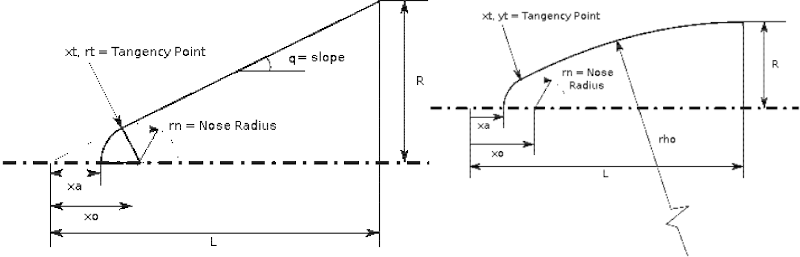

# GSLV MK-III Payload Fairing
> This script creates GSLV Mk-III payload fairing contour in 2D with dimensions and a 3D view.   

# Update    
Updated to reflect the changes from metallic to composite fairing dimensions.

## Table of contents
* [Screenshots](#screenshots)
* [General info](#general-info)
* [References](#references)
* [Setup](#setup)
* [How to run ](#how)
* [Updates](#updates)
* [To-do list](#to-do)

## Screenshots
Output generated by the script.   
#####GSLV-MkIII payload fairing 
   
   

## General info
This script generates 2D and 3D contour plots of gslv mk-iii payload fairing.  
&nbsp;   
The main structural purpose of the payload fairing is to protect the payload from aerodynamic loading, heating, acoustic vibration,and other environmental conditions during the ascent phase.The payload fairing is no longer required once the vehicle clears the atmosphere.
This consists of four major sections:    

1.   Spherical nose cap   
2.   Tangent Ogive section    
3.   Cylindrical section    
4.   Conical frustum, the boat tail section   

Configuration relative sizing and the spherically blunted tangent ogive estimations were acquired from the references given below.    

   
&nbsp;   
&nbsp;   

   

&nbsp;    

## References   
1.  NOSE CONE DESIGN    
http://www.rimworld.com/nassarocketry/pdfs/050-NOSE%20CONE%20DESIGN.pdf

2.  Design and Analysis of a Metallic Ogive Payload Fairing for a New Generation Launch Vehicle    
https://www.iosrjournals.org/iosr-jmce/papers/vol13-issue5/Version-1/N13050199103.pdf    

3.  expression_of_interest_-_vssc-2017.pdf   
https://www.isro.gov.in/sites/default/files/tenders/expression_of_interest_-_vssc-2017.pdf    
&nbsp;   

## Setup
Script is written with python (Version: Python 3.8.5) on linux. Additional modules required :   

* numpy  (tested with Version: 1.19.4 )
* matplotlib (tested with Version:  3.3.3 )   

## How to run   
* Verify and install required modules 
* run `python payload_fairing.py`. 

## Updates   
* [26Jan2021]   
  Updated the code to reflect the changes in payload fairing from metallic structure to composite. Extracted information from the isro tender details as included in reference no.3   
   

## To-do list
* 

